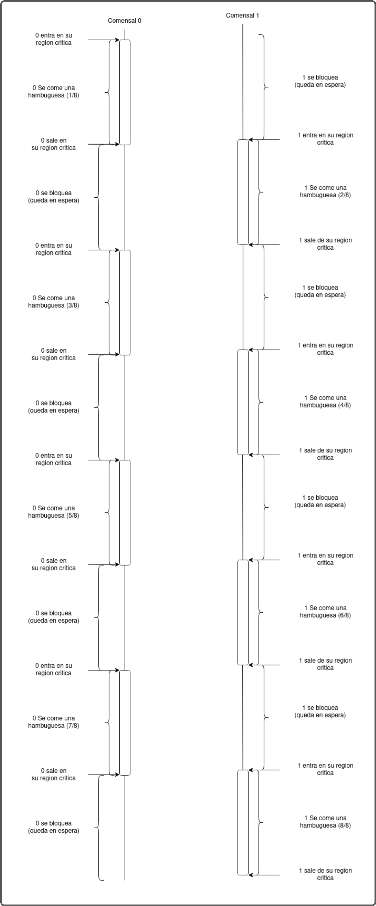

1)
    a) Se puede notar que el archivo "sinhilos.py" tarda mas tiempo en ejecutarse (alrededor de 5seg) que el archivo "conhilos.py" (alrededor de 4seg). Era predecible que el archivo "conhilos.py" se cargue mas rapido porque utiliza threading (los hilos), que sirven para operaciones concurrentes dentro de un solo proceso.
    b)Lo comparamos y pudimos ver que los tiempos de ejecucion son parecidos, ya que, lo unico que va variando son los milisegundos.
    c)Antes de descomentar las lineas comentadas, el valor daba 0 y el tiempo de ejecucion era milisegundos (menor que 1seg) pero una vez descomentado tomo mas tiempo (alrededor de 2seg) y daba un resultado tanto positivo y negativo e iba variando demasiado. Esto ocurre porque al descomentar el ciclo for, le agrega una carga a la CPU lo que aumenta el tiempo de ejecucion. Gracias a esto, el acumulador (que es la zona critica) tiene un aumento en la carga de trabajo el cual da problemas en la sincronizacion de hilos. La race condition seria lo que ocaciona lo anterior, que tire resultados diferentes por ejecucion.
2)
    a)
    ```c
    #include <pthread.h>
    #include <stdio.h>
    #include <stdlib.h>
    #define NUMBER_OF_THREADS 2
    #define CANTIDAD_INICIAL_HAMBURGUESAS 20
    int cantidad_restante_hamburguesas = CANTIDAD_INICIAL_HAMBURGUESAS;
    int turno = 0;

    void *comer_hamburguesa(void *tid)
    {
	    while (1 == 1)
	    { 
	    	while(turno!=(int)tid);
        // INICIO DE LA ZONA CRÍTICA
	    	if (cantidad_restante_hamburguesas > 0)
	    	{
	    		printf("Hola! soy el hilo(comensal) %d , me voy a comer una hamburguesa ! ya que todavia queda/n %d \n", (int) tid, cantidad_restante_hamburguesas);
	    		cantidad_restante_hamburguesas--; // me como una hamburguesa
	    	}
	    	else
	    	{
	    		printf("SE TERMINARON LAS HAMBURGUESAS :( \n");
	    		turno = (turno + 1)% NUMBER_OF_THREADS;
	    		pthread_exit(NULL); // forzar terminacion del hilo
	    	}
        // SALIDA DE LA ZONA CRÍTICA   
	    	turno = (turno + 1)% NUMBER_OF_THREADS;
	    }
    }

    int main(int argc, char *argv[])
    {
	    pthread_t threads[NUMBER_OF_THREADS];
	    int status, i, ret;
	    for (int i = 0; i < NUMBER_OF_THREADS; i++)
	    {
		    printf("Hola!, soy el hilo principal. Estoy creando el hilo %d \n", i);
		    status = pthread_create(&threads[i], NULL, comer_hamburguesa, (void *)i);
		    if (status != 0)
		    {
		    	printf("Algo salio mal, al crear el hilo recibi el codigo de error %d \n", status);
		    	exit(-1);
		    }
	    }

	    for (i = 0; i < NUMBER_OF_THREADS; i++)
	    {
	    	void *retval;
	    	ret = pthread_join(threads[i], &retval); // espero por la terminacion de los hilos que cree
	    }
	    pthread_exit(NULL); // como los hilos que cree ya terminaron de ejecutarse, termino yo tambien.
    }
    b) 